# Atualização de pacotes da Stack, mllibprodest e modelo-teste

Este procedimento é para guiar a atualização de pacotes da Stack de ML (Machine Learning), biblioteca de ML (mllibprodest) e do modelo de teste da Stack (modelo-teste).

A atualização de pacotes pode acontecer em algum repositório em particular, em mais de um, ou em todos ao mesmo tempo. O que vai definir a abrangência da atualização são os nomes dos pacotes que serão atualizados, por exemplo, se um pacote precisa ser atualizado e o mesmo constar em dois repositórios, logo esses dois repositórios precisarão ser atualizados, inclusive **as versões dos pacotes devem ser obrigatoriamente as mesmas**.

**DICA**: Comece pelo repositório da **mllibprodest** e verifique se os pacotes que foram atualizados nesse repositório constam nos outros dois repositórios (Stack ML e modelo teste).

## 1. Preparando para atualizar

Escolha os repositórios que serão atualizados:

- [mllibprodest](https://github.com/prodest/mllibprodest)
- [Modelo de teste](https://github.com/prodest/modelo-teste)
- [Stack de ML](https://github.com/prodest/prodest-ml-stack)

### 1.1 Fork e clone

Realize o _fork_ dos repositórios escolhidos e clone cada um dos _forks_ criados, conforme o [tutorial oficial do Github](https://docs.github.com/en/pull-requests/collaborating-with-pull-requests/working-with-forks/fork-a-repo). Lembre-se  
de substituir o repositório informado no tutorial para teste pelo repositório de onde será feito o _fork_.

Para facilitar, escolha a plataforma e maneira que achar mais adequadas para o seu caso.

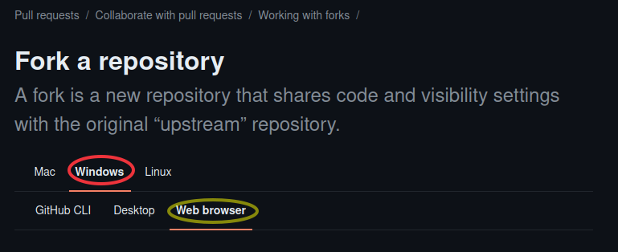

### 1.2 Criar _branch_

Crie uma _branch_ para acomodar suas alterações. Entre nas pastas criadas no processo de clonagem do _fork_ e rode os comandos abaixo:

```
git checkout -b atualizar_pacotes
```

Verifique que agora o repositório tem uma nova _branch_:

```
git branch
```

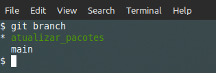

## 2. Editar os arquivos necessários para atualizar os pacotes

Entre nas pastas criadas no processo de clonagem dos repositórios e procure pelos arquivos, conforme segue. Os passos **2.1**, **2.2**, **2.3** e **2.4** podem ser realizados fora da ordem, pois os repositórios não possuem, necessariamente, todos esses tipos de arquivos.

**DICA**: Para todos os pacotes que estão nos arquivos **Dockerfile** e **requirements.txt**, é possível utilizar o [site com o índice de pacotes Python](https://pypi.org/) para realizar buscas e verificar os dados dos pacotes, tais como: versão, data da atualização, etc.


### 2.1 Editar Dockerfiles

Entre na pasta/subpastas criadas no processo de clonagem do _fork_ do repositório da Stack; procure pelos arquivos chamados 'Dockerfile'; edite e retire todas as versões dos pacotes. Deixe somente os nomes dos pacotes.

**DICA**: Procure por todas as linhas que começam com **RUN** para encontrar os referidos pacotes. Pode acontecer de ter uma quebra de linha "\\" e possuir pacotes na linha seguinte.

- Exemplo de Dockerfile com as versões dos pacotes:


Supondo que o pacote esteja descrito como **pymongo==4.6.2**, apague a parte da versão **==4.6.2** e deixe somente o nome do pacote: **pymongo**.

- Exemplo de Dockerfile **SEM** as versões dos pacotes:


Faça isso para todos os arquivos **Dockerfile** (**EXCETO** o Dockerfile que está dentro da pasta **temp_builder**).

### 2.2 Editar o arquivo do Docker compose

Entre na pasta **stack** (encontra-se dentro da pasta criada no processo de clonagem do fork do repositório da Stack) e abra o arquivo **docker-compose.yml**. Procure pelas linhas iniciadas por **image:** que possuam um comentário acima delas iniciado por **https://hub.docker.com**. Para cada uma das linha encontradas, faça o seguinte:

- Acesse o link que está no comentário, no exemple da imagem abaixo é **https://hub.docker.com/_/mongo** e procure por uma versão mais atualizada para a imagem Docker descrita na linha iniciada por **image:**.

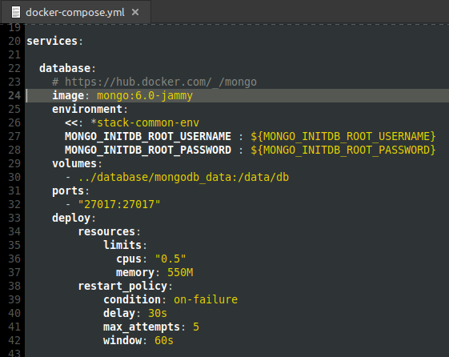

Utilize como base o nome da imagem, e sufixos como por exemplo **jammy**, conforme exemplo, e faça um filtro por _tags_ para encontrar a imagem mais atualizada.

**ATENÇÃO**: Esse processo é delicado e requer atenção, pois deve ser evitado obter imagens que são _release candidate_ (rc, RC), _beta_, etc. Sempre escolha imagens com versões estáveis.

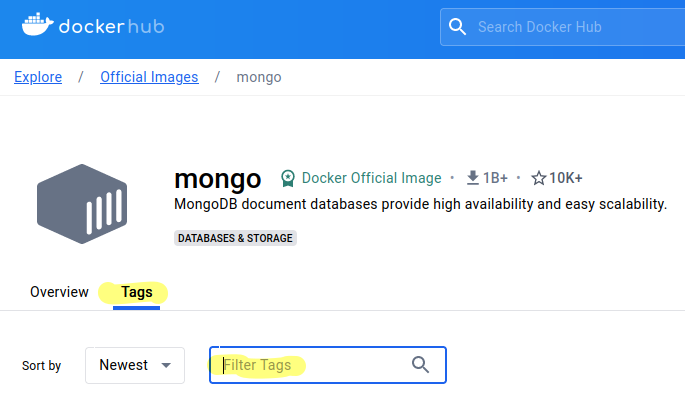

Para exemplificar, se for filtrado por **jammy**, poderia ser escolhida a imagem conforme figura abaixo, pois está mais próxima da imagem que se deseja atualizar.


Altere a versão da imagem para a nova versão, conforme nome da imagem destacada na figura acima. Por exemplo, substitua da seguinte forma:

- **image: mongo:6.0-jammy** por **image: mongo:7.0-jammy**


Faça o mesmo processo para as outras imagens que constam no arquivo **docker-compose.yml**.

**ATENÇÃO**: Parar evitar a "quebra" dos componentes da Stack, **JAMAIS** deixe as versões das imagens apontadas para _latest_! Sempre coloque a versão específica que desejar.

### 2.3 Editar requirements

Entrar na pasta criada no processo de clone do modelo de teste; procurar por todos os arquivos **requirements.txt** e também retirar as versões dos pacotes.

- Exemplo de requirements.txt com as versões dos pacotes:

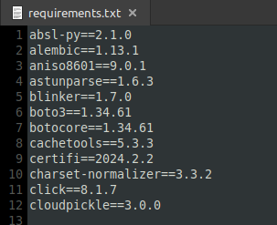

- Exemplo de requirements.txt **SEM** as versões dos pacotes:

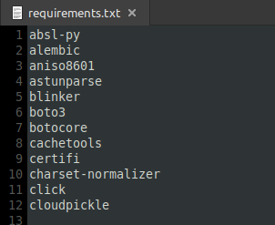

### 2.4 Editar pyproject.toml

Procure pelo arquivo **pyproject.toml** que está dentro da pasta criada no processo de clonagem do _fork_ do repositório da **mllibprodest** e altere de acordo com os exemplos, da seguinte forma:

- Exemplo de arquivo pyproject.toml com as versões dos pacotes

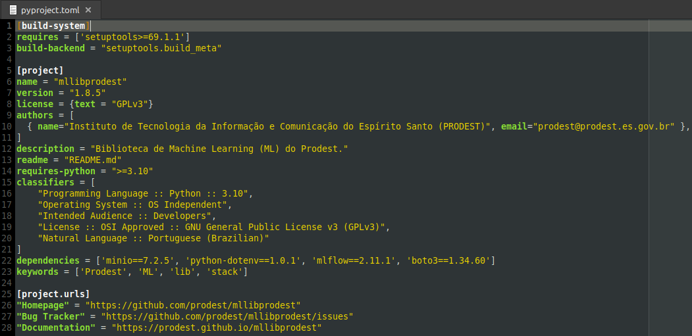

- Retire a versão do Setup tools da linha: **requires = ['setuptools>=69.1.1']** deve ficar assim: **requires = ['setuptools']**

- Altere a versão da mllibprodest somando 1 no último campo numérico na linha: **version = "1.8.5"**, que nesse exemplo ficará assim: **version = "1.8.6"**

- Retire as versões dos pacotes que constam na linha: **dependencies = ['minio==7.2.5', 'python-dotenv==1.0.1', ...]**. Deve ficar assim: **dependencies = ['minio', 'python-dotenv', ...]**

Depois das alterações realizadas, o arquivo deverá ficar parecido com a imagem abaixo.

- Exemplo de arquivo pyproject.toml **SEM** as versões dos pacotes e com a versão da mllibprodest alterada

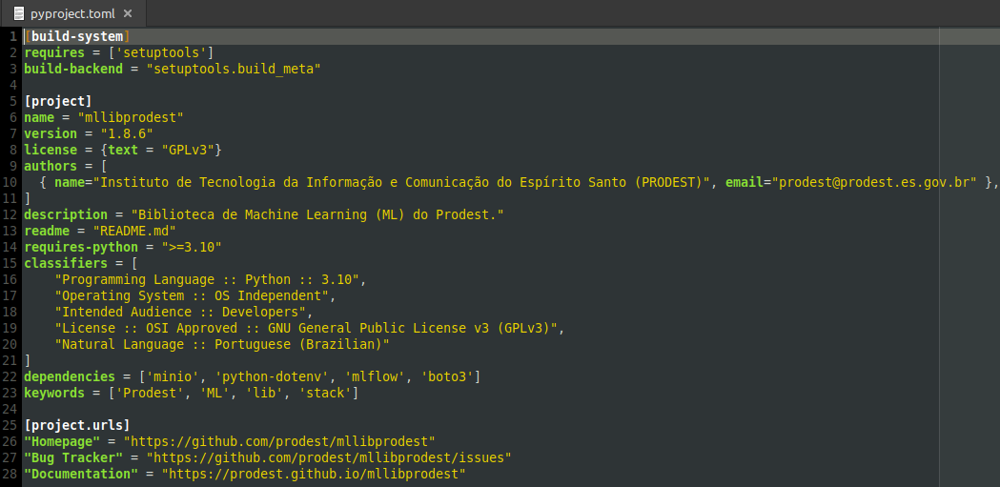

## 3. Faça o _build_ da mllibprodest

Caso os pacotes da **mllibprodest** precisarem ser atualizados, será preciso fazer o _build_ da mllibprodest para gerar um pacote instalável pelo **pip**. Siga os passos abaixo:

### 3.1 Crie uma pasta para realizar o _build_

Crie uma pasta, com o nome que desejar, e copie a pasta criada no processo de clonagem do _fork_ do repositório da mllibprodest para dentro dela.

### 3.2 Crie um ambiente virtual Python e ative-o

Abra um _prompt_ de comando e entre na pasta criada no **passo 3.1**; depois entre na pasta do _fork_ do repositório da mllibprodest.

Crie o ambiente virtual de acordo com a versão requerida pela lib (nesse exemplo é 3.11, veja na linha **requires-python = ">=3.11"** do arquivo **pyproject.toml**).

```bash
python3.11 -m venv env
```

Ative o ambiente virtual.

```bash
source env/bin/activate
```

### 3.3 Faça o _'build'_ da biblioteca

Antes de rodar os comandos para construir o pacote com a biblioteca, atualize o _pip_, _build_ e _twine_.

```bash
python -m pip install --upgrade pip build twine
```

De dentro da pasta criada no processo de clonagem do _fork_ do repositório (mllibprodest) que está dentro da pasta criada no **passo 3.1**, rode o comando abaixo.

- Constrói o pacote e salva na pasta _'dist'_.

```bash
python -m build
```

**ATENÇÃO**: O arquivo gerado nesse passo será utilizado no **passo 4.4**.

## 4. Preparar as pastas

Antes de fazer o deploy da Stack, é necessário preparar as pastas e colocá-las de forma que facilitem o processo.

### 4.1 Crie uma pasta para realizar os testes

Para não desorganizar os arquivos criados nas clonagens dos _forks_, pois no final do processo será necessário fazer um _commit_ dos arquivos alterados, crie uma pasta para testes separada.

### 4.2 Copie a pasta da Stack

Copie a pasta criada no processo de clonagem do _fork_ do repositório da Stack para dentro da pasta criada para os testes no **passo 4.1**.

### 4.3 Copie a pasta publicar

Copie a pasta **publicar**, que está dentro da pasta criada no processo de clonagem do _fork_ do repositório do modelo de teste, para dentro da pasta com os arquivos da Stack que foi copiada para a pasta de teste no **passo 4.2**.

### 4.4 Copie a lib para o modelo-teste

Se a **mllibprodest** foi atualizada, conforme **passo 3**, é mandatório que o modelo de teste seja atualizado com a nova versão da lib.

Para atualizar o modelo de teste com a versão atualizada da **mllibprodest**, copie o arquivo **mllibprodest-x.y.z-py3-none-any.whl** (onde x.y.z é a versão da mllibprodest), que foi gerado no **passo 3.3** e está dentro da pasta **dist**, para as pastas abaixo, que estão dentro da pasta **publicar** que foi copiada conforme **passo 4.3**:

- publicar/worker_pub
- publicar/worker_retrain

Além disso, edite os arquivos **requirements.txt** constantes nas duas pastas (worker_pub e worker_retrain) e substitua a linha **mllibprodest** pelo nome do arquivo gerado pelo _build_, que nesse exemplo é **mllibprodest-1.8.6-py3-none-any.whl**, conforme imagens abaixo:

- Antes:


- Depois:


### 4.5 Apague a pasta do _build_ da mllibprodest

Apague a pasta criada para o _build_ da mllibprodest no **passo 3.1**.

### 4.6 Confira a organização das pastas

Após a cópia das pastas, confira se a organização ficou correta. Supondo que o nome da pasta de testes ficou como '**teste**' e que foi colocado um prefixo '**fork\_**' no _fork_ do repositório da Stack, a organização ficaria assim:

Perceba que a pasta **publicar** foi copiada para dentro da pasta da Stack, conforme **passo 4.3**.


Caso tenha sido atualizada, observe o destaque para o arquivo da mllibprodest dentro das pastas dos **_workers_ pub e retrain**, que estão dentro da pasta **publicar**, conforme instruído no **passo 4.4**.

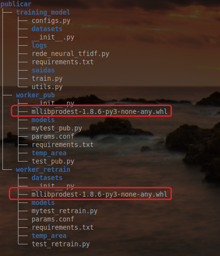

## 5. Subir a Stack para realizar testes

Após a preparação dos arquivos e pastas, conforme os passos anteriores, suba a Stack de ML para que sejam instaladas as últimas versões dos pacotes e/ou as versões das imagens que foram alteradas no arquivo **docker-compose.yml**.

Para subir a Stack de ML:

- Abra um **prompt** de comando;
- Entre na pasta com o _fork_ da Stack que está dentro da pasta preparada para os testes no **passo 4**;
- Utilize os passos descritos do README do repositório dela ([repo da Stack](https://github.com/prodest/prodest-ml-stack)) a partir do **passo 1.2**, pois o clone **NÃO** deve ser feito para que a pasta de teste seja utilizada.

No item '**1.2. Construir as imagens e subir o ambiente**', responda às perguntas do _script_ **build.sh**, conforme abaixo:

- Responda **_no_** para evitar clonar o modelo-teste novamente;
- Responda **_yes_** para utilizar a pasta **publicar** com os arquivos alterados.


Continue seguindo as intruções do README até que a Stack esteja funcionando corretamente.

**ATENÇÃO**: Caso aconteçam erros na instalação dos pacotes o processo de _build_ falhará. Verifique as mensagens de erros, identifique e acerte os erros; volte para o passo '**1.2. Construir as imagens e subir o ambiente**' do README.

**ATENÇÃO**: Se você fizer alguma alteração nos arquivos da pasta de teste, não esqueça de atualizar os das pastas dos _forks_ dos repositórios para que o _commit_ seja realizado com os arquivos atualizados.

## 6. Realizar os testes

Depois de realizar o **passo 5** acima, com sucesso, inclusive com o modelo de teste treinado e registrado (conforme **passos 2 e 3.2** do [repo da Stack](https://github.com/prodest/prodest-ml-stack)) já é um forte indício de que a atualização dos pacotes ocorreu com sucesso!

### 6.1 Teste de _stress_ simples

No repositório da Stack de ML possui um passo, para aquele contexto é opcional, que deve ser utilizado aqui para realizar um teste de _stress_ simples dos componentes da Stack.

- Para realizar este teste siga as instruções do **passo 5.3** do [repo da Stack](https://github.com/prodest/prodest-ml-stack).

### 6.2 Teste de retornos da API da Stack

O teste de retorno verifica se a API da Stack, após a atualização, continua retornando valores esperados e corretos. O _script_ para realização deste teste está junto com o _script_ para realização do teste de _stress_ simples (dentro da pasta **optional**).

- Continue no ambiente virtual Python criado, conforme **passo 5.3** do [repo da Stack](https://github.com/prodest/prodest-ml-stack)

- Reinicie o container da API.

```bash
docker restart stack-api-1
```

- Execute o _script_ **return_tests.py**.

```
python return_tests.py
```

Confira a saida do _script_ na tela para saber se está tudo correto.

## 7. Obter as versões dos pacotes que foram atualizados

Depois de tudo testado e funcionando, obtenha as versões dos pacotes que foram instaladas no processo de _build_ da Stack de ML.

### 7.1 - Dockerfiles e requirements

Para obter as versões dos pacotes instalados através das modificações nos arquivos Dockerfile e requirements, será necessário verificar nos containers abaixo:

| Componente      | Nome do container        | Nome do arquivo com as versões |
| --------------- | ------------------------ | ------------------------------ |
| API             | stack-api-1              | req_api.txt                    |
| Model Registry  | stack-model-registry-1   | req_model_reg.txt              |
| Worker Training | stack-mltraining-model-1 | req_worker_train.txt           |
| Worker PUB      | stack-worker-pub-1       | req_worker_pub.txt             |
| Worker Retrain  | stack-worker-retrain-1   | req_worker_retrain.txt         |

Abra um _prompt_ de comando; entre na pasta de **onde o _build_ da Stack foi realizado** e rode os comandos a seguir para obter as versões.

```bash
docker start stack-api-1 && docker exec stack-api-1 pip list --format=freeze > req_api.txt
```

```bash
docker start stack-model-registry-1 && docker exec stack-model-registry-1 pip list --format=freeze > req_model_reg.txt
```

```bash
docker start stack-mltraining-model-1 && docker exec stack-mltraining-model-1 pip list --format=freeze > req_worker_train.txt && docker stop stack-mltraining-model-1
```

```bash
docker start stack-worker-pub-1 && docker exec stack-worker-pub-1 pip list --format=freeze > req_worker_pub.txt
```

```bash
docker start stack-worker-retrain-1 && docker exec stack-worker-retrain-1 pip list --format=freeze > req_worker_retrain.txt && docker stop stack-worker-retrain-1
```

Caso ocorram com sucesso, as execuções dos comandos acima gerarão os arquivos conforme figura abaixo.

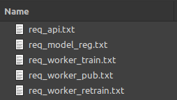

### 7.2 - Pacotes da mllibprodest

Se os pacotes da mllibprodest foram atualizados, obtenha as versões conforme instruções abaixo:

- Entre na pasta **publicar** que foi copiada para dentro da pasta de onde a Stack foi construida.


- Entre na pasta **worker_pub** (que está dentro da pasta **publicar**).


- Crie e ative um ambiente virtual Python, conforme instruções: [Linux e Windows (escolha o sistema na página)](https://packaging.python.org/en/latest/guides/installing-using-pip-and-virtual-environments/#creating-a-virtual-environment);

- Atualize o pip e o setuptools.

```bash
pip install --upgrade pip setuptools
```

- Instale a mllibprodest diretamente do pacote **whl** (destaque na imagem anterior). Substitua **x.y.z** pela versão nova versão da mllibprodest.

```bash
pip install mllibprodest-x.y.z-py3-none-any.whl
```

- Obtenha a lista de pacotes. Será gerado um arquivo chamado **req_mllib.txt**.

```bash
pip list --format=freeze > req_mllib.txt
```

**DICA**: Para facilitar, se preferir, copie este arquivo para mesma pasta dos arquivos gerados no **passo 7.1**.

## 8. Atualizar os arquivos dos _forks_

De posse dos arquivos gerados no **passo 7**, faça o inverso do que foi feito nos **passos 2.1, 2.3 e 2.4**. Em suma, retorne com as versões que foram instaladas no _build_ da Stack.

Por exemplo, para o pacote rich:

| Antes | Depois       |
| ----- | ------------ |
| rich  | rich==13.7.1 |

As versões atualizadas dos pacotes devem ser extraídas dos arquivos gerados, conforme correspondência na tabela abaixo:

| Componente                     | Arquivo para atualizar | Arquivo com as versões novas |
| ------------------------------ | ---------------------- | ---------------------------- |
| API (Stack)                    | Dockerfile             | req_api.txt                  |
| Model Registry (Stack)         | Dockerfile             | req_model_reg.txt            |
| Worker PUB (Stack)             | Dockerfile             | req_worker_pub.txt           |
| Worker Training (modelo-teste) | requirements.txt       | req_worker_train.txt         |
| Worker PUB (modelo-teste)      | requirements.txt       | req_worker_pub.txt           |
| Worker Retrain (modelo-teste)  | requirements.txt       | req_worker_retrain.txt       |
| mllibprodest                   | pyproject.toml         | req_mllib.txt                |

**ATENÇÃO**:

- No caso específico da **API**, edite o arquivo **Dockerfile** e atualize a linha **ENV STACK_VERSION="ra.b.c (mllibprodest==x.y.z)"**, somando 1 ao terceiro número da versão da Stack (representado por c em ra.b.c). Atualize também x.y.z com a nova versão da **mllibprodest**.

- No caso específico da **mllibprodest** (caso tenha sido atualizada), edite o arquivo **pyproject.toml** e atualize a linha **version = "x.y.z"** com a nova versão da **mllibprodest**.

## 9. Subir a Stack (novamente) para realizar testes

Após a atualização das versões dos pacotes, teste **novamente** a Stack, que agora possui os arquivos com as versões fixadas. Proceda da seguinte forma:

- Destrua a Stack, conforme **passo 7** descrito no [repo da Stack](https://github.com/prodest/prodest-ml-stack).
- Apague a pasta que foi criada para a realização dos testes.
- Execute novamente os **passos 3, 4, 5 e 6**, para construir e testar a Stack.
- Destrua a Stack.

## 10. Solicitar a inclusão das atualizações no repositório remoto

Com os arquivos dos _forks_ dos repositórios atualizados e a Stack testada novamente, crie um _pull request_ para que os pacotes sejam atualizados nos repositórios remotos.

**ATENÇÃO**: Repita os comandos abaixo para cada repositório que foi atualizado.

### 10.1 Faça o _commit_ e _push_

Antes de realizar o _pull request_ faça _commit_ e _push_ das suas alterações, através da sua ferramenta de programação ou através dos comandos abaixos, efetuados via _prompt_ de comando dentro das pastas dos _forks_ dos repositórios:

```
git add .
git commit -m "MENSAGEM INFORMATIVA"
git push --set-upstream origin atualizar_pacotes
```

Onde: **"MENSAGEM INFORMATIVA"** é uma mensagem que descreva o _commit_ realizado.

### 10.2 Crie um _pull request_

Siga as instruções no [tutorial oficial do Github](https://docs.github.com/en/pull-requests/collaborating-with-pull-requests/proposing-changes-to-your-work-with-pull-requests/creating-a-pull-request) para realizar o **_pull request_**. Escolha a plataforma e maneira que achar mais adequadas para o seu caso.

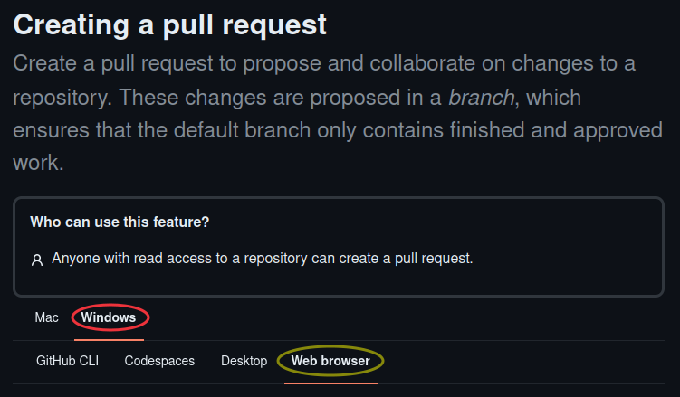

**ATENÇÃO**: Os _pull requests_ são verificados e aprovados pelos donos dos repositórios oficiais, portanto as atualizações propostas não serão aplicadas automaticamente e podem levar alguns dias para acontecerem.
